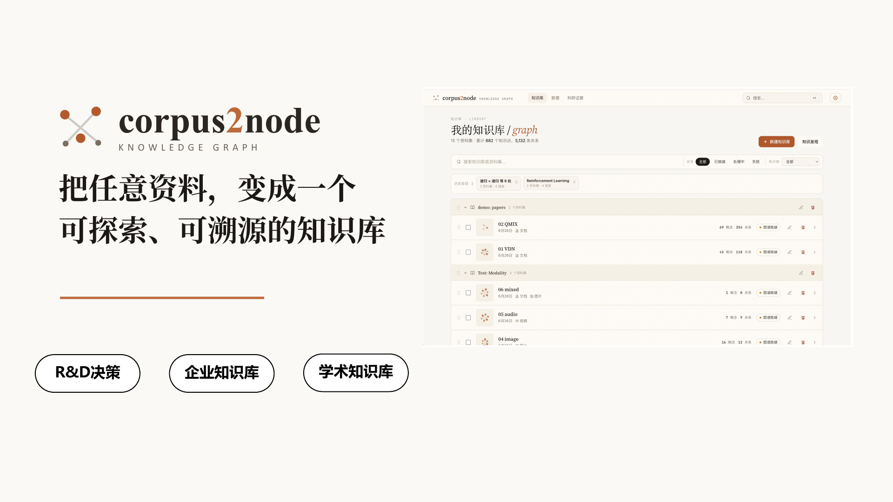
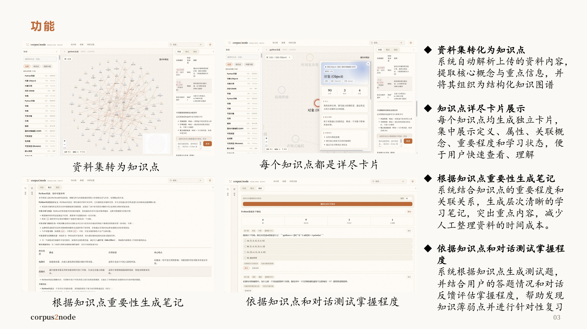
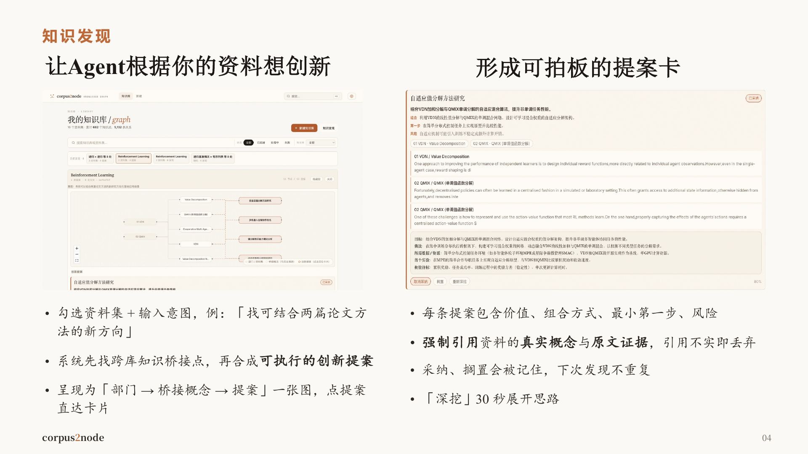
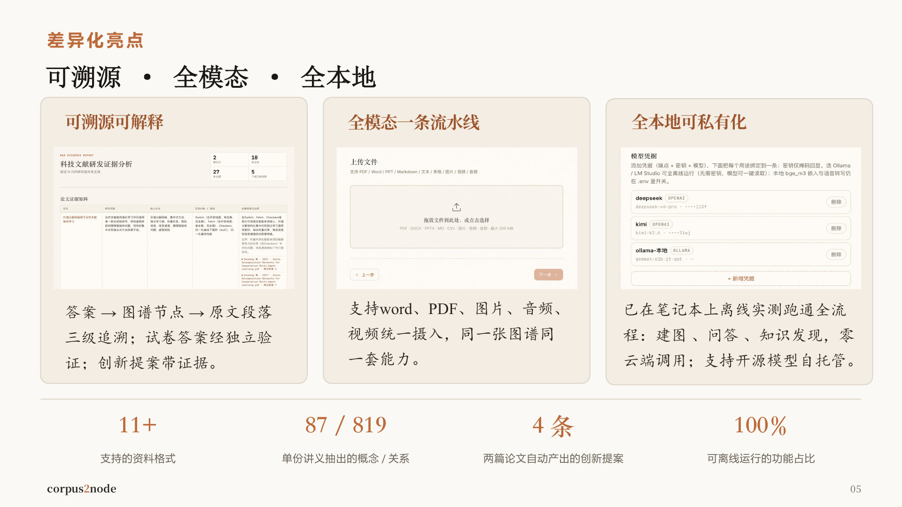

# Corpus2Node

把 PDF、Word/PPT、Markdown、图片、音频、视频等资料变成一个可探索、可溯源的知识图谱，并基于这张图完成问答、笔记、测试与跨资料集知识发现。



## 为什么做

普通 RAG 很容易变成黑箱：答案看起来合理，但很难追到它到底来自哪份资料、哪个段落。Corpus2Node 的核心思路是先把资料离线结构化成图谱，再让在线 Agent 在图谱和原文 chunk 上检索回答。

- 资料输入：文档、PDF、课件、图片、音频、视频统一摄入。
- 知识图谱：抽取概念、关系、主题社区、重要度与出处。
- 可溯源回答：答案引用图谱节点和原文片段，未命中资料时不硬编。
- 学习产物：按知识点重要度生成笔记和水平测试。
- 知识发现：跨多个资料集寻找桥接概念，生成带证据的创新提案。
- 私有化：支持 OpenAI-compatible 云端模型，也支持 Ollama / LM Studio 等本地模型。

## 功能预览

### 资料变知识图谱



上传资料后，离线 workflow 会完成摄入、切块、概念/关系抽取、质量检查和图谱构建。节点大小来自中心性算法，颜色来自主题社区；点开节点可以查看定义、摘要、属性、关联关系和出处。

### 知识发现



多个已建图资料集可以被组合分析。系统先寻找跨库桥接概念，再生成可执行提案，并要求每条提案引用两边资料中的真实概念与原文证据。

### 可溯源、全模态、可本地



Corpus2Node 强调三点：答案可追到图谱节点和原文段落；文档、图片、音视频走同一套能力；模型凭据可插拔，支持全本地离线运行。

## 架构

项目分为两条路径：

- 离线 workflow：`ingest -> extract -> critic -> build`
- 在线 agent：`search_graph` / `retrieve_chunks` / `get_subgraph` 等工具检索后回答

确定性算法不交给 LLM，包括中心性、社区发现、实体合并、共现边、布局和可溯源校验。业务产物以本地 JSON artifact 保存，LangGraph checkpoint 只保存运行态引用。

主要技术栈：

- Backend: FastAPI, Pydantic, LangChain, LangGraph, NetworkX
- Frontend: React 18, Vite, TypeScript, ReactFlow
- Storage: local JSON artifacts, optional PostgreSQL for account deployment
- Model layer: multi-provider credential registry with per-purpose bindings

## 本地启动

要求 Python 3.12、uv 0.10.x、Node.js 22。

```bash
uv sync --dev
uv run uvicorn corpus2node.api.app:app --reload --port 8000
```

另开终端启动前端：

```bash
cd frontend
npm ci
npm run dev
```

打开：

```text
http://localhost:5173
```

如需本地 BGE-M3 embedding：

```bash
uv sync --extra ml
```

如需音频转写能力：

```bash
uv sync --extra audio
```

## 验证

```bash
uv run ruff check src tests scripts
uv run pytest -q
```

前端：

```bash
cd frontend
npm test
npm run build
```

API 契约更新：

```bash
uv run python scripts/export_openapi.py
cd frontend
npm run generate:api
```

## 部署与演示

- Docker / PostgreSQL / 账号模式部署：见 [deploy/README.md](deploy/README.md)
- 产品演示台本：见 [docs/demo/DEMO.md](docs/demo/DEMO.md)
- 演示 PDF：见 [docs/demo/Corpus2Node-演示.pdf](docs/demo/Corpus2Node-演示.pdf)

## 项目文档

- 架构决策与重构策略：[AGENTS.md](AGENTS.md)
- 当前进度与功能映射：[docs/PROGRESS.md](docs/PROGRESS.md)
- 会话交接：[docs/SESSION.md](docs/SESSION.md)
