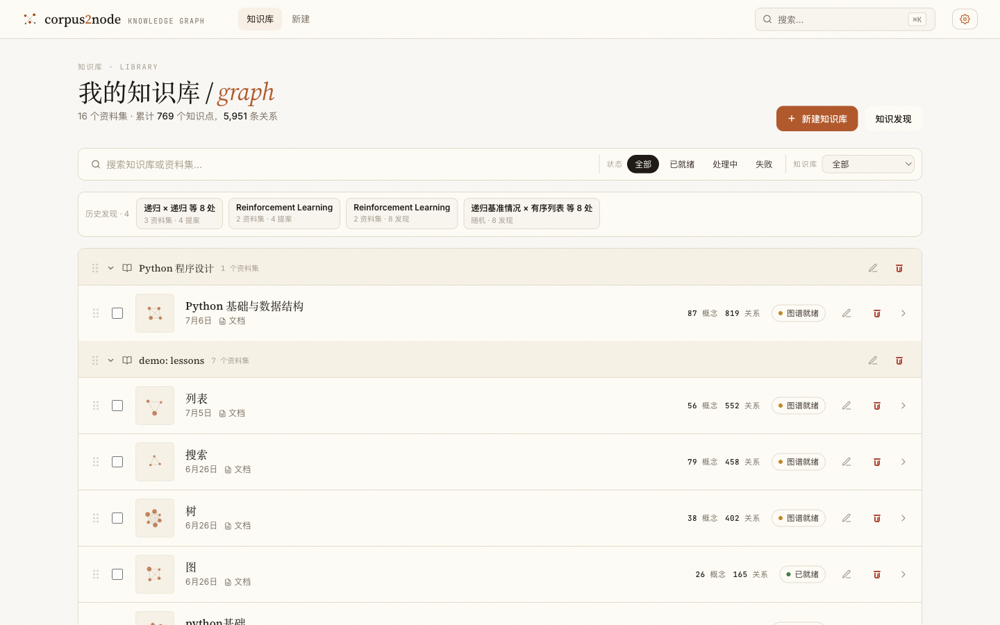
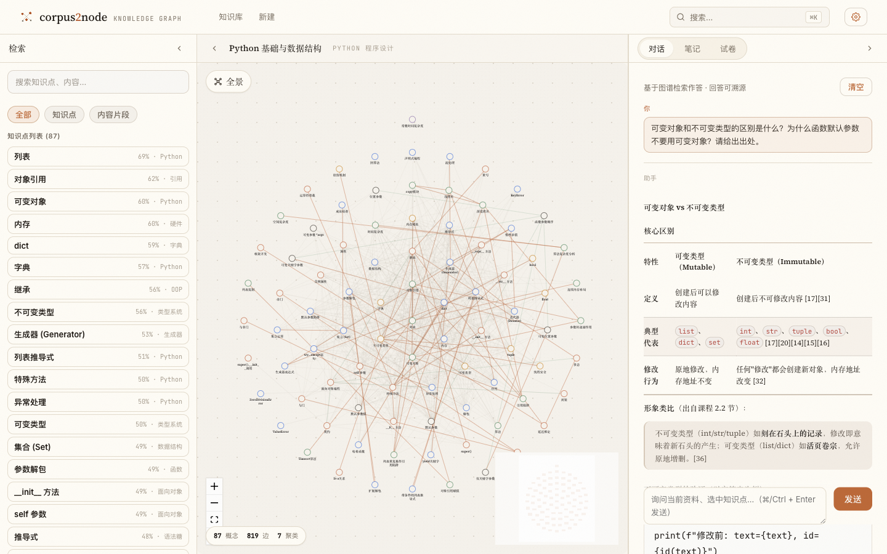
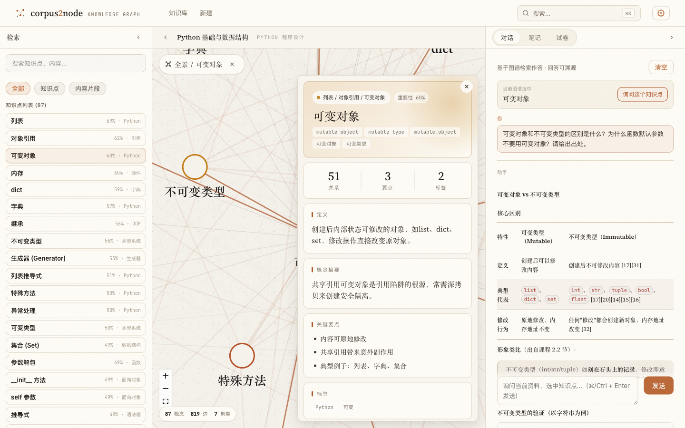
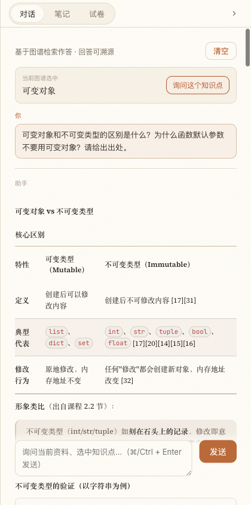
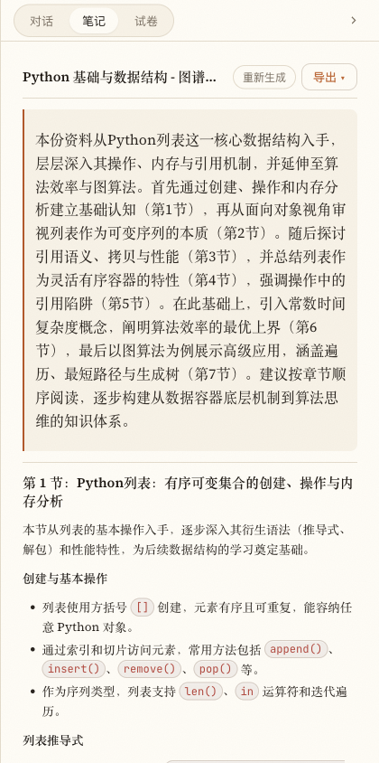
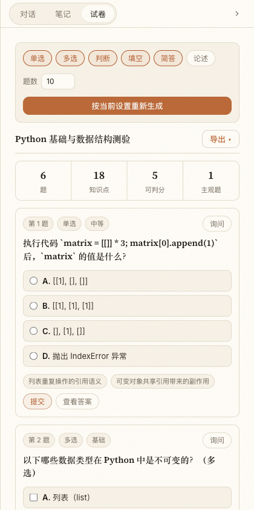
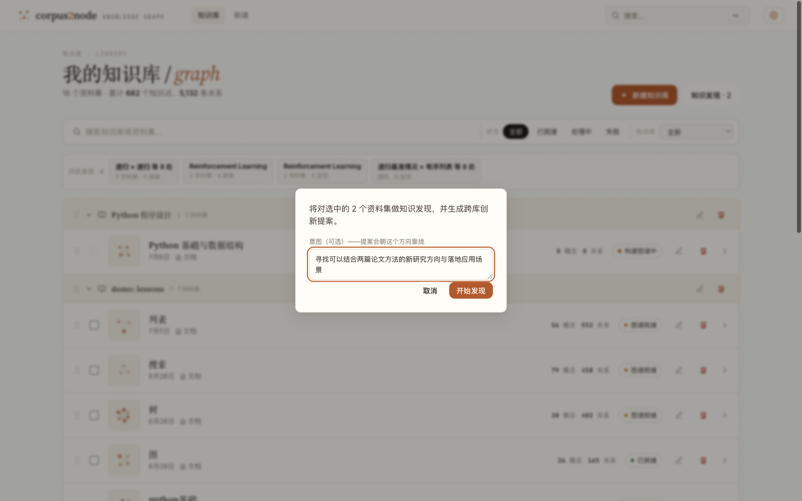
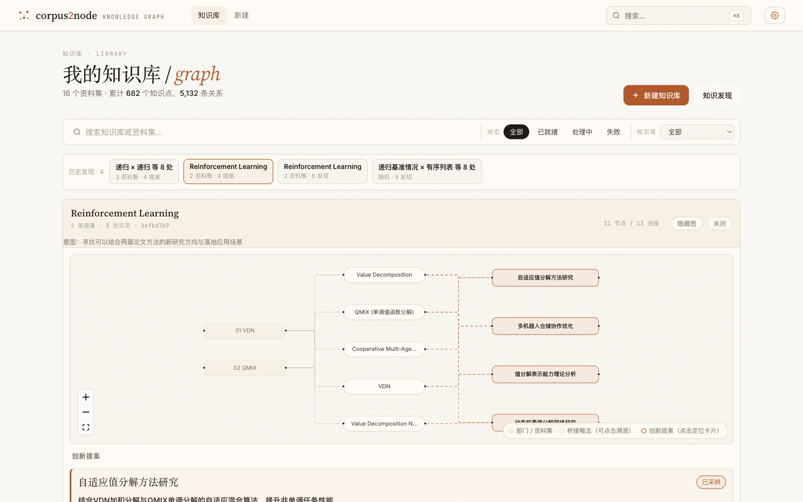
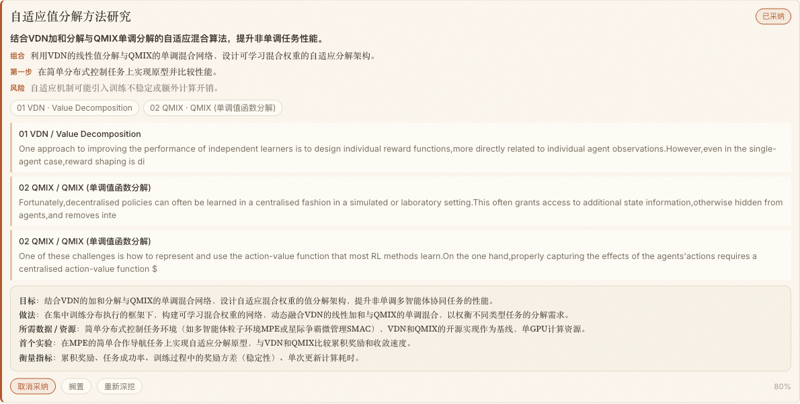
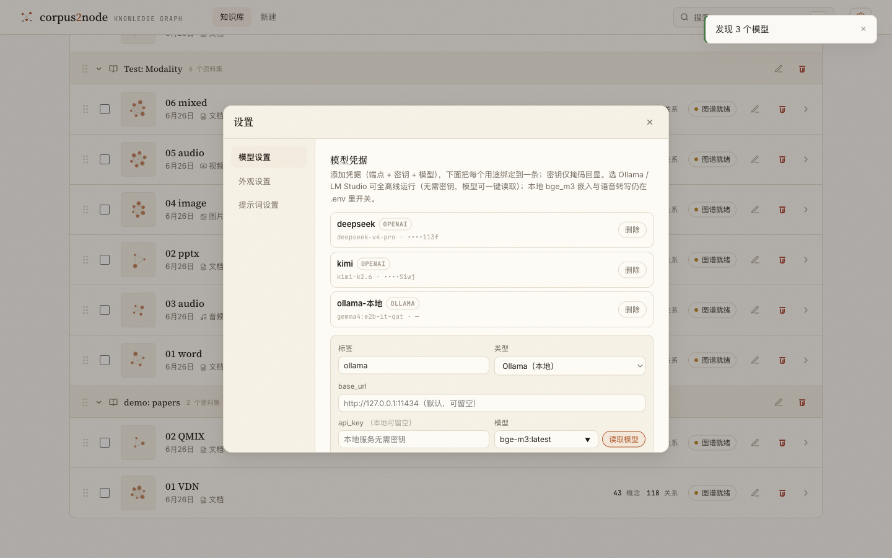

# Corpus2Node 产品演示

> **一句话**：把团队手里的任意资料——文档、PDF、课件、图片、音视频——变成一个**可探索、可溯源**的知识库：问答有出处、笔记试卷一键生成、跨库还能自动产出**可拍板的创新提案**；需要时**全流程在本地跑，数据不出内网**。
>
> 本文档：六幕产品叙事（真实截图）→ 3–5 分钟现场台本 → 现场 runbook。所有截图都是本机真实数据实拍，无摆拍数据。

---

## 第一幕 · 所有资料，一个知识库



- 按「知识库 → 资料集」两级组织；每个资料集显示**知识点数 / 关系数 / 构建状态**。
- 来源标签一眼可见：**文档（含 Word/PPT/PDF）、图片、音频、视频**——全模态摄入，同一条流水线。
- 顶部「历史发现」：跨库知识发现的成果随时回看（第五幕）。

> 台词：「大家的资料散在文档、课件、录音里。丢进来，几分钟后它们变成一张知识网络。」

## 第二幕 · 资料变成一张知识图谱



- 这份 100 页的 Python 讲义 PDF，自动抽取出 **87 个知识点、819 条关系、7 个主题社区**（按颜色分区）。
- 节点大小 = 重要度（图算法计算，不靠模型拍脑袋）；左栏按重要度排好序，就是这份资料的「目录 + 考点表」。



- 点任意知识点：**定义 / 摘要 / 关键要点 / 51 条关联关系**，中英文别名自动归并（mutable object = 可变对象 = 可变类型）。
- 右上「询问这个知识点」——图谱和问答是打通的。

> 台词：「这不是词云，是带类型关系的知识网络——『默认参数陷阱』是『可变对象』导致的，图里就有这条边。」

## 第三幕 · 问答有出处（招牌一）



- 问：「可变对象和不可变类型的区别？为什么函数默认参数不要用可变对象？」
- 回答自动整理成对比表，**每个论断后面跟着 [17][31] 这样的引用编号**；下方引用列表能看到每一条对应的**原文片段和出处**，点击直达。
- 答案只基于你的资料检索作答——资料里没有的，它会明说没有，而不是编一个。

> 台词：「和黑箱 AI 的区别就在这：每句话你都能点开看『它是从我资料的哪一段来的』。审计、汇报、教学都敢用。」

## 第四幕 · 笔记与试卷，一键沉淀

| 结构化笔记 | 自测试卷 |
|---|---|
|  |  |

- **笔记**：按主题社区分 7 节，每节落到具体知识点，可导出 Markdown/PDF/LaTeX。
- **试卷**：6 题覆盖 18 个知识点，单选/多选/判断/简答可配；**每道题标注它考的知识点**，且经过独立求解器验证答案（出题器出题、求解器背靠资料重做一遍，对不上就打回重出）。

> 台词：「资料进来，复习材料和自测卷就是顺手的事——而且每道题都能溯源到知识点。」

## 第五幕 · 跨库知识发现：AI 给老板递创新提案（压轴）

设想：各部门把季度汇报交上来，各成一个资料集。老板不需要读完所有材料——勾选几个库，写一句意图：



系统先在图谱层面找出跨库的**知识桥接点**，再合成**可执行的创新提案**。呈现为「部门 → 桥接概念 → 提案」的一张图：



每条提案是一张可拍板的卡片——**一句话价值 / 怎么组合两边能力 / 最小第一步 / 风险**，下方引用两边资料的原文证据：



- 老板可以**采纳 / 搁置**（系统记住，下次不再重复提）；对中意的点**深挖**，30 秒展开成「目标 / 做法 / 所需资源 / 首个实验 / 衡量指标」的最小方案。
- 上图为真实输出：两篇多智能体强化学习论文（VDN、QMIX），系统提出「自适应值分解方法研究」并给出可执行首步——**提案强制引用两边资料的真实概念，引用不实的提案会被系统丢弃**。

> 台词：「这一幕解决的是『材料都交了，谁来想创新』。AI 通读所有库，把跨部门的组合机会连证据一起递到你面前，你只做判断：采纳、搁置、深挖。」

## 第六幕 · 全本地私有化（招牌二）



- 模型是**可插拔凭据**：云端（DeepSeek / Kimi / 任意 OpenAI 兼容端点）与**本地（Ollama / LM Studio）**并存，每个用途独立绑定。
- 选「Ollama（本地）」：免密钥、端点留空即可，「读取模型」一键列出本机模型——截图里就是真实读到的 3 个本地模型。
- **全流程已在一台 MacBook（M3）上离线实测跑通**：建图、问答、出卷、知识发现，零云端调用。
- 生产私有化三档（详见 `docs/DEPLOYMENT_MODELS.md`）：单卡 24GB 起步 → 单模型全包（Qwen3-VL-32B）→ 旗舰集群，全部开源权重。

> 台词：「合规团队最关心的问题，答案是：整套系统可以在你们自己的机器上跑，资料一个字节都不出内网。」

---

## 3–5 分钟现场台本

> 预热（演示前 5 分钟）：`corpus start` → 打开首页确认全部「图谱就绪」→ 保持第五幕的历史发现可点。全程**零现场生成**（所有产物已缓存，秒开），只有一次可选的现场提问。

| 时间 | 幕 | 操作 | 台词要点 | 兜底 |
|------|----|------|---------|------|
| 0:00–0:30 | 一 | 停在首页 | 痛点：资料散、读不完、AI 答案不敢信。一句话定位 | — |
| 0:30–1:15 | 二 | 点开「Python 基础与数据结构」，点全景，点左栏「可变对象」 | 100 页 PDF → 87 知识点 819 关系 7 主题；节点卡=定义+关系 | 图渲染慢就先讲左栏列表 |
| 1:15–2:15 | 三 | 右栏「对话」标签，滚动已有回答 | 指着 [17][31]：「每句话有出处」；往下滚引用列表点一条 | 想现场提问：问「浅拷贝和深拷贝的区别？」（资料内必答）；超时 15 秒就切回已有回答讲 |
| 2:15–2:45 | 四 | 切「笔记」「试卷」标签各停 10 秒 | 一键沉淀；试卷带知识点标签 + 答案经独立验证 | — |
| 2:45–4:15 | 五 | 回首页 → 点历史发现「Reinforcement Learning · 4 提案」 | 老板场景叙事；指桥接图三列；滚到「自适应值分解方法研究」卡：已采纳徽章 → 深挖块五行方案 | 不现场跑发现（3 篇论文级要 1–2 分钟）；全部用缓存报告 |
| 4:15–5:00 | 六 | 设置 → 模型设置 | 三条凭据并存；Ollama 免密钥 + 读取模型；「数据不出内网」收尾 | — |

**收尾一句**：「资料进来是一张可追问的知识网络，出去是笔记、试卷和带证据的创新提案——云端可用，全本地也行。」

## 现场 Runbook

```bash
corpus start        # 后台起前后端（8000 / 5173）；状态：corpus status
open http://localhost:5173
# 演示结束
corpus stop
```

- **演示账号数据**：主秀库 = 「Python 程序设计 / Python 基础与数据结构」（session b4f59dff，87 概念）；压轴 = 历史发现「Reinforcement Learning · 4 提案」（VDN×QMIX，含已采纳+深挖）；副例 = 「递归 × 递归 等 8 处 · 4 提案」（教学场景）。
- **不要现场做的事**：重跑主秀库 workflow（约 10 分钟）；对 3 个以上大库现场跑发现（1–2 分钟起）。现场生成只建议 chat 一问（20–35 秒）。
- **网络故障兜底**：云端模型不可用时，问答/发现的新请求会失败——直接讲已缓存产物（本文所有截图均为缓存产物，演示不依赖现场生成）。
- **复位**：若现场误采纳/搁置了提案，在提案卡点「取消采纳 / 恢复」即可；误跑的发现在历史条目里可忽略（不影响其它数据）。
